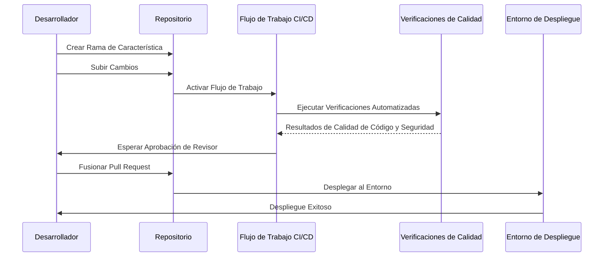

## Reglas de Protección de Ramas

### Beneficios

- Garantiza que nadie pueda realizar envíos directos a ramas críticas.
- Obliga al uso de pull requests.
- Permite la integración de herramientas automatizadas como:
  - **SonarQube**: Para revisiones de calidad de código.
  - **Snyk**: Para el análisis de vulnerabilidades en dependencias y contenedores.

## Revisiones de Calidad y Seguridad

### Proceso de Revisión de Código

1. Cuando un desarrollador crea un pull request:
   - Ejecutar SonarQube para el análisis de calidad de código.
   - Ejecutar Snyk para analizar vulnerabilidades.

2. El pull request no puede ser fusionado hasta que:
   - Todas las verificaciones automatizadas hayan pasado.
   - La revisión manual del código sea aprobada por los revisores designados.

---

## Diagrama del Flujo de Trabajo DevOps

## **Ventajas de Simplificar los Entornos y Usar Pruebas Temporales**

## **1. Menor complejidad en la gestión**

- Tendremos solo dos entornos principales: uno para pruebas finales
(UAT) y otro para producción, lo que hace más fácil su administración.
- El equipo dedicará menos tiempo a mantener y coordinar múltiples
entornos, lo que permite enfocarse más en el desarrollo.

## **2. Evitar problemas de coordinación**

- Se elimina la necesidad de mantener diferentes versiones del proyecto
en varios lugares, reduciendo errores por descoordinación.
- Habrá un flujo más claro y ordenado de trabajo, disminuyendo el
riesgo de que cambios importantes se pierdan o se sobreescriban.

## **3. Pruebas más confiables**

- Cada nueva funcionalidad tendrá su propio espacio temporal para
pruebas, asegurando que lo que se evalúe sea exactamente lo que se está proponiendo
- Esto permite detectar y solucionar problemas específicos sin afectar
otras partes del proyecto.

## **4. Acelerar el proceso de trabajo**

- Las nuevas características se podrán probar de inmediato en estos
entornos temporales, sin depender de un entorno compartido.
- Los equipos podrán colaborar más rápidamente, revisando y ajustando
los cambios al instante.

## **5. Mejor capacidad de respuesta**

- Esta forma de trabajo es ideal para manejar varios cambios al mismo
tiempo, sin que unos interfieran con otros.
- Es una solución escalable que permite al equipo crecer y manejar más
proyectos sin complicaciones adicionales.

## **Flujo a seguir para pull requests con previews**

1. **Crear una rama de desarrollo por feature o bug**

   Cada nueva funcionalidad o corrección de errores debe tener su
   propia rama basada en main o la rama más actual.

2. **Desarrollar y confirmar cambios**

   Realizar los cambios necesarios en la rama y agregar commits claros y organizados.

3. **Abrir un pull request**

   Subir la rama al repositorio y crear un PR apuntando a la rama UAT para revisión.

   Es necesario incluir una descripción detallada de los cambios
   realizados, explicando qué se hizo y por qué.

   Se establecerá un template de PR para asegurar que toda la
   información necesaria esté estructurada y sea consistente en cada
   solicitud.

4. **Generar un preview para el PR**

   Configurar el pipeline CI/CD para desplegar automáticamente un
   entorno temporal al abrir un PR. Esto incluye:
   - Se establecera un ruteo basado en el ID del PR.
   - Subir archivo de configuracion de despliegue al S3.
   - Utilizar terraform para crear un entorno temporal.

5. **Revisar cambios**

   - **Equipo de desarrollo y QA:** Verifican el preview, realizan
   pruebas funcionales y revisan la experiencia del usuario.
   - **Automatización:** Ejecutar pruebas automatizadas como unitarias,
   de integración, y end-to-end.

6. **Aprobar o realizar ajustes**

   Una vez aprobado el PR, fusionar los cambios a la rama UAT.

7. **Desplegar a UAT**

   Configurar un pipeline para que los cambios en la rama UAT se
   desplieguen automáticamente al entorno de UAT.

8. **Validar en UAT**

   Ejecutar pruebas finales en UAT. Si se aprueba, los cambios estarán
   listos para pasar a producción.

9. **Fusionar a main**

   Una vez validados los cambios, fusionar la rama UAT a main para su
   despliegue en producción.
